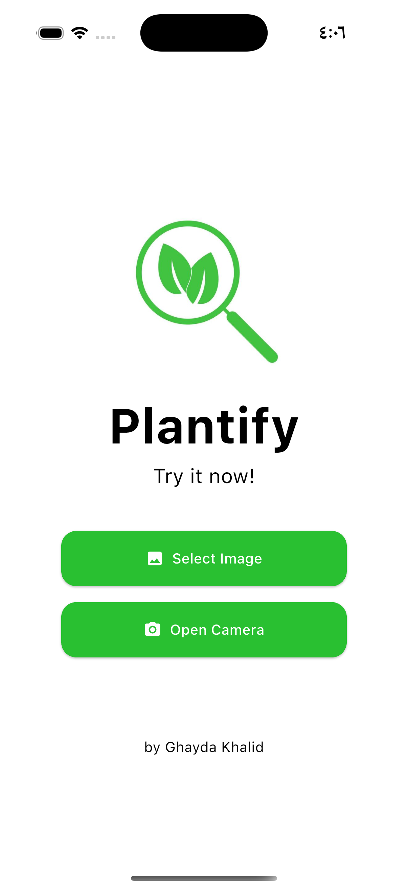
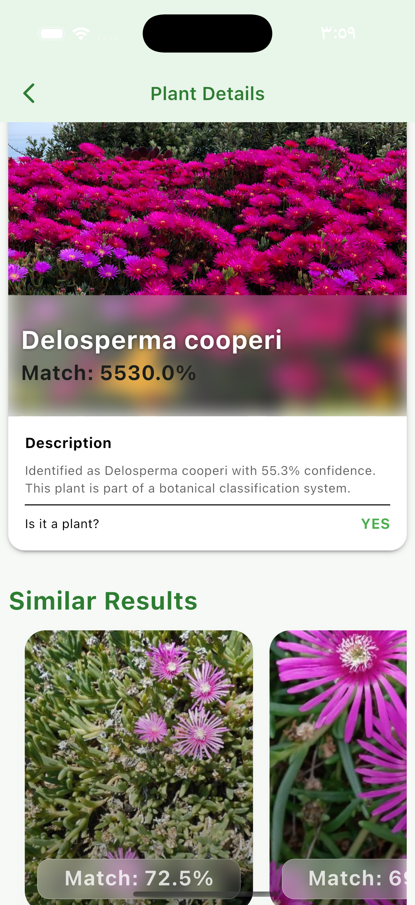

# 🌿 Meet A Flora

**Meet A Flora** is a high-standard Flutter application designed to bridge the gap between nature and technology. Using AI-powered recognition, the app identifies plants in real-time and provides **dynamically generated botanical data** every time a user interacts with a species.

Built with a focus on **Clean Architecture** and **Professional State Management**, this project demonstrates how to handle complex AI integrations while maintaining a scalable and testable codebase.

---

## 📸 Screenshots & User Flow

The following screenshots demonstrate the application flow, from plant identification to the dynamic glassmorphism detail view.

| **1. Discovery & Scanning** | **2. AI Analysis (Glass UI)** |
|:---:|:---:|
|  |  |
| **Seamless Identification:**   Capture plants via camera or select   from the local gallery. | **Dynamic Fresh Data:**   Real-time AI results displayed with   high-fidelity glass effects. |

---

## 🚀 Key Features

* **AI Plant Recognition:** Seamless integration with Camera and Gallery to identify plants using advanced AI models.
* **Dynamic Fresh Data:** Unlike static apps, plant details (care tips, descriptions) are auto-generated and refreshed on every visit, ensuring unique content.
* **Glassmorphism UI:** A modern, high-fidelity user interface featuring glass-like containers and blurred backgrounds.
* **Professional Navigation:** Powered by `GoRouter` for secure and declarative data passing between screens.

---

## 🏗️ Architecture & Technical Stack

This project strictly adheres to **Clean Architecture** principles to ensure decoupling of business logic from UI and data sources.

### 📁 Layer Breakdown:
* **Domain Layer:** Contains purely functional `Entities`, `UseCases`, and `Abstract Repositories`.
* **Data Layer:** Handles `Models`, `DataSources`, and the concrete implementation of repositories.
* **Presentation Layer:** Powered by `BLoC` for state management, following the state pattern: *Initial, Loading, Success, and Failure*.

### 🛠️ Tech Stack:
* **State Management:** Flutter BLoC.
* **Networking:** `Dio` with Interceptors for secure API communication.
* **Routing:** `GoRouter`.
* **Responsiveness:** `Sizer` & `Gap`.
* **UI Elements:** `GlassKit`, `AnyImageView`.

---

## 🛡️ Error Handling & Standards

We follow the **Strict No-Try-Catch in UI** policy. All errors are handled using:
* **Either Pattern:** Functional error handling using the `dartz` package.
* **Failure Concept:** Mapping system-level exceptions to specific `Failure` objects (e.g., `ServerFailure`, `CameraFailure`).
* **Clean Code:** Adherence to SOLID principles and meaningful naming conventions.

---

## 👨‍💻 Developed By
**Ghayda Khalid**
*A Tuwaiq Bootcamp Project*
